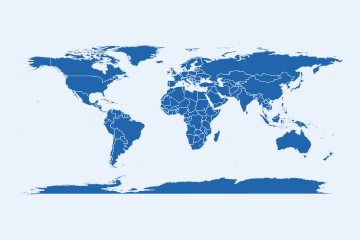

<!-- README.md is generated from README.Rmd. Please edit that file -->

```{r, include = FALSE}
knitr::opts_chunk$set(
  collapse = TRUE,
  comment = "#>",
  message = FALSE,
  warning = FALSE,
  fig.path = "man/figures/README-",
  out.width = "100%"
)
```

# worlddatajoin 

<!-- badges: start -->
[](https://github.com/PursuitOfDataScience/worlddatajoin/actions/workflows/R-CMD-check.yaml)
[](https://app.codecov.io/gh/PursuitOfDataScience/worlddatajoin)
[](https://lifecycle.r-lib.org/articles/stages.html#stable)
<!-- badges: end -->

Country names never line up across data sources. `"US"`, `"U.S."`,
`"United States"`, `"United States of America"` and `"America"` are the same
country, but a naïve `left_join()` treats them as five. **worlddatajoin** kills
that pain by making **ISO codes the universal join key** and handing you a
single, ready-to-map tibble that already stitches together three otherwise
disjoint worlds:

- **`ggplot2::map_data("world")`** (or Natural Earth `sf`) — *where* countries are,
- **[WDI](https://github.com/vincentarelbundock/WDI)** — *what* is true about them (World Bank indicators),
- **[countrycode](https://github.com/vincentarelbundock/countrycode)** — the Rosetta stone (ISO codes, continents, regions) that makes the join possible.

The happy path is one call: `world_data(2020)`. Everything else is opt-in.

## Installation

```r
# install.packages("devtools")
devtools::install_github("PursuitOfDataScience/worlddatajoin")
```

The base install is light. Heavy spatial extras (`sf`, `rnaturalearth`,
`cartogram`, `biscale`, `geofacet`, `gganimate`, `leaflet`, …) live in
`Suggests` and are only needed for the features that use them.

```{r}
library(worlddatajoin)
library(ggplot2)
library(dplyr)
```

## One call to a map-ready tibble

```{r}
data_2020 <- world_data(2020)
data_2020
```

`world_data()` returns the map geometry, the requested World Bank indicator(s),
income and continent — already keyed on `iso3c`/`iso2c`. Draw a choropleth with
the built-in `world_map()` helper (no more hand-rolled `geom_polygon()`
boilerplate):

```{r readme-choropleth}
world_map(data_2020, gdp_per_capita, style = "quantile",
          title = "GDP per capita, 2020")
```

```{r readme-income}
world_map(data_2020, income, style = "categorical")
```

## Any indicator, any year span

Pass one or many WDI codes with friendly names, or a year range to get a panel:

```{r}
country_data(2020, c(life_exp = "SP.DYN.LE00.IN", co2 = "EN.GHG.CO2.PC.CE.AR5")) |>
  head()
```

Use the bundled `common_indicators` catalogue so you never memorise a code:

```{r}
head(common_indicators)
```

## Get *your own* data onto a map

This is the headline use case. You have a frame keyed on messy country names —
`join_world()` standardises it and attaches geometry in one call:

```{r readme-join, fig.height = 4}
my_data <- data.frame(
  nation = c("U.S.", "S. Korea", "Czechia", "Kosovo", "Cote d'Ivoire"),
  score  = c(10, 8, 6, 4, 7)
)

my_data |>
  join_world(nation, warn = FALSE) |>
  world_map(score, title = "My data, joined on the ISO spine")
```

Or reconcile two messy tables directly — `"Czech Republic"` vs `"Czechia"`,
`"South Korea"` vs `"Korea, Rep."` just work:

```{r}
a <- data.frame(country = c("Czechia", "South Korea"), gdp = c(1, 2))
b <- data.frame(nation  = c("Czech Republic", "Korea, Rep."), pop = c(10, 51))
country_join(a, b, country, nation)
```

## Never lose a country silently

```{r}
check_country_match(c("USA", "Cote d'Ivoire", "Yugoslavia", "Wakanda"))
```

## Reference data at your fingertips

```{r}
convert_country(c("Japan", "Brazil", "Germany"), to = "flag")
convert_country(c("Japan", "Brazil", "Germany"), to = "currency")
in_group(c("France", "United States", "Japan"), "EU")
```

## A whole vocabulary of honest maps

Beyond the choropleth: proportional-symbol (`bubble_map()`), bivariate
(`bivariate_map()`), area-honest cartograms (`cartogram_map()`), equal-area tile
grids (`tile_map()`), great-circle flows (`flow_map()`), animation
(`animate_world()`) and interactivity (`interactive_map()`).

```{r readme-bubble, fig.height = 4}
bubble_map(world_snapshot$countries, population)
```

## Offline by default

The bundled `world_snapshot` (a curated indicator set for one recent year, plus
metadata) means examples, tests and vignettes all run without the World Bank
API.

## Learn more

See the vignettes — *Getting started*, *Joining your own data*, *Modern maps
with sf & projections*, and *Beyond the choropleth* — and the
[reference site](https://pursuitofdatascience.github.io/worlddatajoin/).
