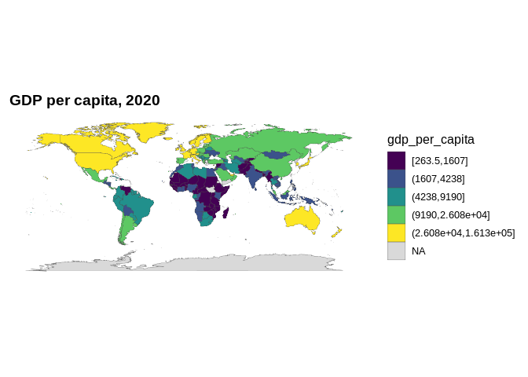
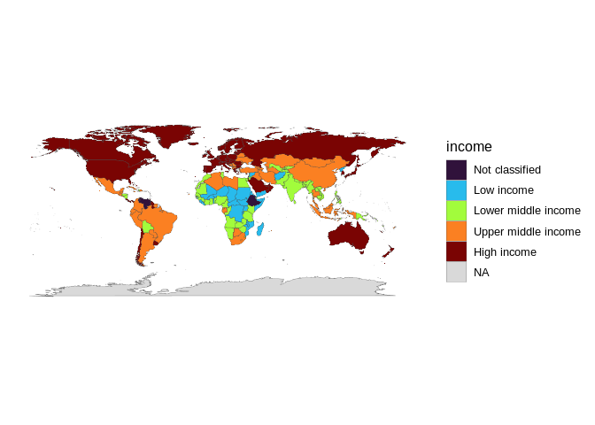
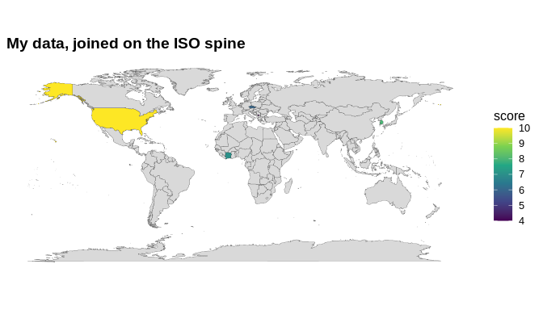
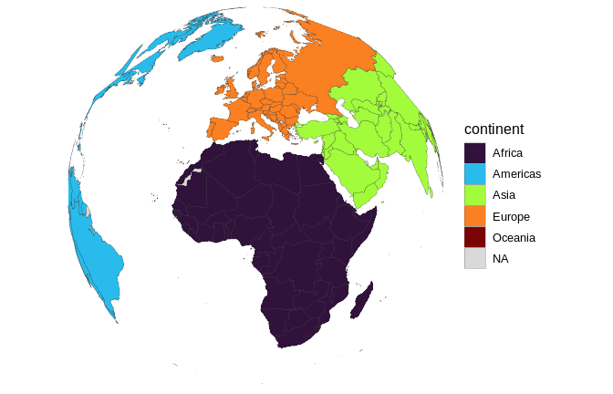
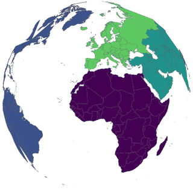
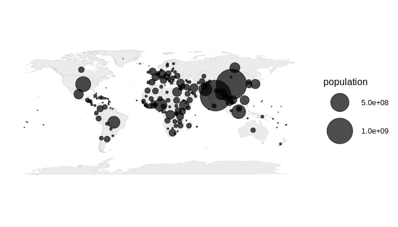

<!-- README.md is generated from README.Rmd. Please edit that file -->

# countryatlas 

<!-- badges: start -->

[](https://CRAN.R-project.org/package=countryatlas)
[](https://github.com/PursuitOfDataScience/countryatlas/actions/workflows/R-CMD-check.yaml)
[](https://app.codecov.io/gh/PursuitOfDataScience/countryatlas)
[](https://lifecycle.r-lib.org/articles/stages.html#stable)
<!-- badges: end -->

Country names never line up across data sources. `"US"`, `"U.S."`,
`"United States"`, `"United States of America"` and `"America"` are the
same country, but a naïve `left_join()` treats them as five.
**countryatlas** kills that pain by making **ISO codes the universal
join key** and handing you a single, ready-to-map tibble that already
stitches together three otherwise disjoint worlds:

- **`ggplot2::map_data("world")`** (or Natural Earth `sf`) — *where*
  countries are,
- **[WDI](https://github.com/vincentarelbundock/WDI)** — *what* is true
  about them (World Bank indicators),
- **[countrycode](https://github.com/vincentarelbundock/countrycode)** —
  the Rosetta stone (ISO codes, continents, regions) that makes the join
  possible.

The happy path is one call: `world_data(2020)`. Everything else is
opt-in.

## New in 2.0.0

- **Render maps in the database** with [ggsql](https://ggsql.org):
  `as_ggsql_source()`, `world_query()`,
  `interactive_map(engine = "ggsql")`.
- **More map types**: an orthographic globe (`globe_map()`), small
  multiples (`facet_map()`), and 8 more projections (Winkel tripel,
  orthographic, Gall–Peters, …).
- **Point data onto the spine**: `locate_country()` (point-in-polygon).
- **Cleaner joins**: `repair_country_names()` auto-fixes typos;
  `country_join_all()` reduce-joins many tables at once.
- **More analysis**: `growth_rate()`, `index_to()`, `share_of_world()`.
- **More country groups**: Mercosur, GCC, Nordic, Visegrád.
- **Spatial structure**: `country_borders()` / `neighbors()` (who
  borders whom) and `distance_between()` (great-circle distance, no `sf`
  needed).
- **`dorling_map()`**: the Dorling cartogram as a first-class verb.
- **Correctness fixes** that change map output (quantile binning,
  centroids, label placement, projections, override-only lookups) — full
  [changelog](NEWS.md).

## Installation

``` r
# install.packages("devtools")
devtools::install_github("PursuitOfDataScience/countryatlas")
```

The base install is light. Heavy spatial extras (`sf`, `rnaturalearth`,
`cartogram`, `biscale`, `geofacet`, `gganimate`, `leaflet`, …) live in
`Suggests` and are only needed for the features that use them.

### Optional features at a glance

| Feature / verb | Optional packages required |
|----|----|
| `world_map()` polygon backend | `maps` |
| `world_map()` sf backend, `world_geometry(sf)` | `sf`, `rnaturalearth`, `rnaturalearthdata` |
| `globe_map(backend = "polygon")`, `spin_globe()` | `maps`, `mapproj` |
| `bivariate_map()` | `biscale`, `sf` |
| `cartogram_map()`, `dorling_map()` | `cartogram`, `sf` |
| `country_borders()`, `neighbors()` | `sf` |
| `animate_world()` (animated GIF) | `gganimate` (+ `gifski` or `magick`) |
| `interactive_map(engine = "plotly")` | `plotly` |
| `interactive_map(engine = "ggiraph")` | `ggiraph` |
| `interactive_map(engine = "leaflet")` | `leaflet`, `sf` |
| `interactive_map(engine = "ggsql")`, `as_ggsql_source()` | `ggsql`, `duckdb`, `DBI`, `nanoarrow`, `sf` |
| `tile_map()` with `geofacet`-style small multiples | `geofacet` |
| `simplify_geometry()` with `rmapshaper` | `rmapshaper` |
| `repair_country_names()` / `check_country_match()` with `stringdist` | `stringdist` |

``` r
library(countryatlas)
library(ggplot2)
library(dplyr)
```

## One call to a map-ready tibble

``` r
data_2020 <- world_data(2020)
data_2020
#> # A tibble: 99,338 × 12
#>     long   lat group order subregion iso3c iso2c country continent region income
#>    <dbl> <dbl> <dbl> <int> <chr>     <chr> <chr> <chr>   <chr>     <chr>  <fct> 
#>  1 -69.9  12.5     1     1 <NA>      ABW   AW    Aruba   Americas  Latin… High …
#>  2 -69.9  12.4     1     2 <NA>      ABW   AW    Aruba   Americas  Latin… High …
#>  3 -69.9  12.4     1     3 <NA>      ABW   AW    Aruba   Americas  Latin… High …
#>  4 -70.0  12.5     1     4 <NA>      ABW   AW    Aruba   Americas  Latin… High …
#>  5 -70.1  12.5     1     5 <NA>      ABW   AW    Aruba   Americas  Latin… High …
#>  6 -70.1  12.6     1     6 <NA>      ABW   AW    Aruba   Americas  Latin… High …
#>  7 -70.0  12.6     1     7 <NA>      ABW   AW    Aruba   Americas  Latin… High …
#>  8 -70.0  12.6     1     8 <NA>      ABW   AW    Aruba   Americas  Latin… High …
#>  9 -69.9  12.5     1     9 <NA>      ABW   AW    Aruba   Americas  Latin… High …
#> 10 -69.9  12.5     1    10 <NA>      ABW   AW    Aruba   Americas  Latin… High …
#> # ℹ 99,328 more rows
#> # ℹ 1 more variable: gdp_per_capita <dbl>
```

`world_data()` returns the map geometry, the requested World Bank
indicator(s), income and continent — already keyed on `iso3c`/`iso2c`.
Draw a choropleth with the built-in `world_map()` helper (no more
hand-rolled `geom_polygon()` boilerplate):

``` r
world_map(data_2020, gdp_per_capita, style = "quantile",
          title = "GDP per capita, 2020")
```



``` r
world_map(data_2020, income, style = "categorical")
```



## Any indicator, any year span

Pass one or many WDI codes with friendly names, or a year range to get a
panel:

``` r
country_data(2020, c(life_exp = "SP.DYN.LE00.IN", co2 = "EN.GHG.CO2.PC.CE.AR5")) |>
  head()
#> # A tibble: 6 × 8
#>   iso3c iso2c country        continent region           income life_exp      co2
#>   <chr> <chr> <chr>          <chr>     <chr>            <fct>     <dbl>    <dbl>
#> 1 AFG   AF    Afghanistan    Asia      Middle East, No… Low i…     61.5  0.311  
#> 2 ALB   AL    Albania        Europe    Europe & Centra… Upper…     77.8  1.81   
#> 3 DZA   DZ    Algeria        Africa    Middle East, No… Upper…     73.3  3.90   
#> 4 ASM   AS    American Samoa Oceania   East Asia & Pac… High …     72.7  0.00201
#> 5 AND   AD    Andorra        Europe    Europe & Centra… High …     79.4 NA      
#> 6 AGO   AO    Angola         Africa    Sub-Saharan Afr… Lower…     63.1  0.614
```

Use the bundled `common_indicators` catalogue so you never memorise a
code, or search the full World Bank catalogue offline with
`wdi_search()`:

``` r
head(common_indicators)
#> # A tibble: 6 × 3
#>   name                   code           description                       
#>   <chr>                  <chr>          <chr>                             
#> 1 population             SP.POP.TOTL    Population, total                 
#> 2 gdp                    NY.GDP.MKTP.CD GDP (current US$)                 
#> 3 gdp_constant           NY.GDP.MKTP.KD GDP (constant 2015 US$)           
#> 4 gdp_per_capita         NY.GDP.PCAP.KD GDP per capita (constant 2015 US$)
#> 5 gdp_per_capita_current NY.GDP.PCAP.CD GDP per capita (current US$)      
#> 6 gni_per_capita         NY.GNP.PCAP.CD GNI per capita (current US$)
wdi_search("renewable energy") |> head(3)
#> # A tibble: 3 × 2
#>   indicator                    name                                     
#>   <chr>                        <chr>                                    
#> 1 2.1_SHARE.TOTAL.RE.IN.TFEC   Renewable energy consumption(% in TFEC)  
#> 2 3.1_RE.CONSUMPTION           Renewable energy consumption (TJ)        
#> 3 4.1.2_REN.ELECTRICITY.OUTPUT Renewable energy electricity output (GWh)
```

## Get *your own* data onto a map

This is the headline use case. You have a frame keyed on messy country
names — `join_world()` standardises it and attaches geometry in one
call:

``` r
my_data <- data.frame(
  nation = c("U.S.", "S. Korea", "Czechia", "Kosovo", "Cote d'Ivoire"),
  score  = c(10, 8, 6, 4, 7)
)

my_data |>
  join_world(nation, warn = FALSE) |>
  world_map(score, title = "My data, joined on the ISO spine")
```



Or reconcile two messy tables directly — `"Czech Republic"` vs
`"Czechia"`, `"South Korea"` vs `"Korea, Rep."` just work:

``` r
a <- data.frame(country = c("Czechia", "South Korea"), gdp = c(1, 2))
b <- data.frame(nation  = c("Czech Republic", "Korea, Rep."), pop = c(10, 51))
country_join(a, b, country, nation)
#> # A tibble: 2 × 5
#>   country       gdp iso3c nation           pop
#>   <chr>       <dbl> <chr> <chr>          <dbl>
#> 1 Czechia         1 CZE   Czech Republic    10
#> 2 South Korea     2 KOR   Korea, Rep.       51
```

## Never lose a country silently

``` r
check_country_match(c("USA", "Cote d'Ivoire", "Yugoslavia", "Wakanda"))
#> # A tibble: 4 × 4
#>   input         iso3c matched suggestion
#>   <chr>         <chr> <lgl>   <chr>     
#> 1 USA           USA   TRUE    <NA>      
#> 2 Cote d'Ivoire CIV   TRUE    <NA>      
#> 3 Yugoslavia    <NA>  FALSE   Yugoslavia
#> 4 Wakanda       <NA>  FALSE   Canada
```

## Reference data at your fingertips

``` r
convert_country(c("Japan", "Brazil", "Germany"), to = "flag")
#> [1] "🇯🇵" "🇧🇷" "🇩🇪"
convert_country(c("Japan", "Brazil", "Germany"), to = "currency")
#> [1] "JPY" "BRL" "EUR"
in_group(c("France", "United States", "Japan"), "EU")
#> [1]  TRUE FALSE FALSE
```

## A whole vocabulary of honest maps

Beyond the choropleth: proportional-symbol (`bubble_map()`), bivariate
(`bivariate_map()`), area-honest cartograms (`cartogram_map()`,
including a first-class `dorling_map()`), equal-area tile grids
(`tile_map()`), great-circle flows (`flow_map()`), an orthographic globe
(`globe_map()`), small multiples (`facet_map()`), animation
(`animate_world()`) and interactivity (`interactive_map()`).

The world as a globe, not a rectangle — with the `"polygon"` backend
(only `maps` + `mapproj`, no `sf`) you can draw it and even **spin** it:

``` r
globe_map(world_snapshot$countries, continent, backend = "polygon",
          style = "categorical", lon = 10, lat = 20)
```



``` r
# assemble a rotating GIF (one full turn; needs gifski or magick)
spin_globe(world_snapshot$countries, continent, backend = "polygon",
           style = "categorical")
```



``` r
bubble_map(world_snapshot$countries, population)
```



## Render in the database with ggsql

[ggsql](https://ggsql.org) draws plots *in the database* (DuckDB) and
returns a Vega-Lite widget — no ggplot2 or `sf` runtime needed.
countryatlas does the part ggsql’s static world can’t (ISO
reconciliation, overrides, the WDI join); ggsql does the part
countryatlas doesn’t (push-down + web-ready output). `world_query()`
emits the spatial query (no dependencies):

``` r
world_query(gdp_per_capita, palette = "magma", transform = "log10",
            title = "GDP per capita")
#> VISUALISE gdp_per_capita AS fill
#> FROM countryatlas_world
#> DRAW spatial
#> PROJECT TO equal_earth
#> SCALE fill TO magma VIA log10
#> LABEL title => 'GDP per capita'
```

…and `as_ggsql_source()` / `interactive_map(engine = "ggsql")` register
your curated table and render it in the database. See the *countryatlas
and ggsql* vignette.

## More ways in, more to compute

Get point data onto the spine, repair messy names, reduce-join many
tables, and run panel analysis — all keyed on `iso3c`:

``` r
# each country's share of a world total (within year, for a panel)
share_of_world(data.frame(iso3c = c("USA", "CHN", "IND"), co2 = c(5, 15, 3)), co2)
#> # A tibble: 3 × 3
#>   iso3c   co2 co2_share
#>   <chr> <dbl>     <dbl>
#> 1 USA       5     0.217
#> 2 CHN      15     0.652
#> 3 IND       3     0.130

# reduce-join several messy tables on the ISO spine at once
t1 <- data.frame(country = c("Czechia", "South Korea"), gdp = c(1, 2))
t2 <- data.frame(country = c("Czech Republic", "Korea, Rep."), pop = c(10, 51))
t3 <- data.frame(country = c("Czechia", "Korea"), area = c(79, 100))
country_join_all(list(t1, t2, t3), by = "country")
#> # A tibble: 2 × 7
#>   country.x     gdp iso3c country.y        pop country  area
#>   <chr>       <dbl> <chr> <chr>          <dbl> <chr>   <dbl>
#> 1 Czechia         1 CZE   Czech Republic    10 Czechia    79
#> 2 South Korea     2 KOR   Korea, Rep.       51 Korea     100

# great-circle distance between two countries' centroids (no sf needed)
distance_between("France", "Germany")
#> [1] 802.3524
```

`repair_country_names()` auto-fixes typos to the closest known country,
`locate_country(lon, lat)` tags coordinates with the country that
contains them, `neighbors()` / `country_borders()` answer “who shares a
border with whom”, `growth_rate()` / `index_to()` / `complete_years()`
add panel metrics and fill panel gaps, and `country_codes()` exposes the
whole countrycode crosswalk as a tidy, pipeable lookup.

## Offline by default

The bundled `world_snapshot` (a curated indicator set for one recent
year, plus metadata) means examples, tests and vignettes all run without
the World Bank API.

## Learn more

See the vignettes — *Getting started*, *Joining your own data*, *Modern
maps with sf & projections*, *Beyond the choropleth*, and *countryatlas
and ggsql* — and the [reference
site](https://pursuitofdatascience.github.io/countryatlas/).
