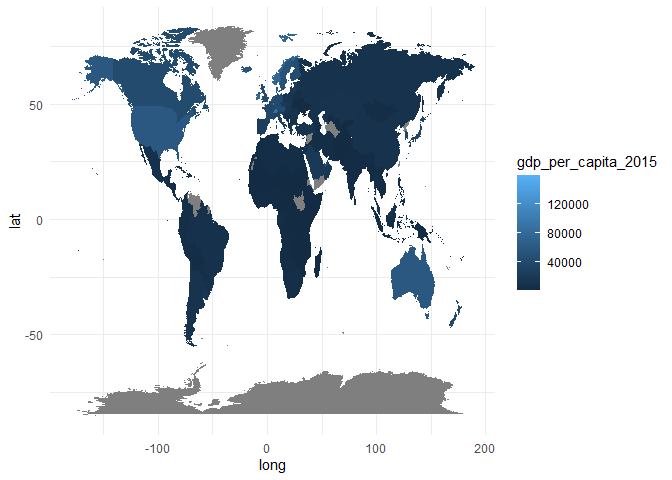

<!-- README.md is generated from README.Rmd. Please edit that file -->

# worlddatajoin

<!-- badges: start -->

[](https://github.com/PursuitOfDataScience/worlddatajoin/actions)
[](https://lifecycle.r-lib.org/articles/stages.html#experimental)
<!-- badges: end -->

The goal of worlddatajoin is to combine `map_data("world")` from ggplot2
with the WDI and countrycode packages together. So far, this package is
on the experimental phase, more functionality will be added in the
future.

## Installation

You can install the development version of worlddatajoin from GitHub
with:

``` r
# install.packages("devtools")
devtools::install_github("PursuitOfDataScience/worlddatajoin")
```

``` r
library(worlddatajoin)
library(ggplot2)
library(dplyr)
```

`map_data("world")` is offered by ggplot2. The tibble is useful,
especially when making a world map, as it offers the geo-coordinates.

``` r
map_data("world") %>%
  head(5)
#>        long      lat group order region subregion
#> 1 -69.89912 12.45200     1     1  Aruba      <NA>
#> 2 -69.89571 12.42300     1     2  Aruba      <NA>
#> 3 -69.94219 12.43853     1     3  Aruba      <NA>
#> 4 -70.00415 12.50049     1     4  Aruba      <NA>
#> 5 -70.06612 12.54697     1     5  Aruba      <NA>
```

As I myself have made so many world maps, one issue I found out is that
it is difficult to join the country names together as the `region`
column above does not align well with the data frames users want to
join. For example, “US” can be “United States”, “America”, “U.S.” or
some other variations. When this happens, the join experience is not
successful.

That is why I have made this worlddatajoin package. To successfully
match countries from various data frames/tibbles, the iso2c and iso3c
codes are used. More than that, GDP per capita and continent information
are also offered in the function `world_data()`. Users only need to
input which year they want to use.

Here is the tibble returned by `world_data()` in the year of 2020:

``` r
data_2020 <- world_data(year = 2020)

data_2020
#> # A tibble: 98,855 x 13
#>     long   lat group order region subregion iso3c iso2c country gdp_per_capita_~
#>    <dbl> <dbl> <dbl> <int> <chr>  <chr>     <chr> <chr> <chr>              <dbl>
#>  1 -69.9  12.5     1     1 Aruba  <NA>      ABW   AW    Aruba                 NA
#>  2 -69.9  12.4     1     2 Aruba  <NA>      ABW   AW    Aruba                 NA
#>  3 -69.9  12.4     1     3 Aruba  <NA>      ABW   AW    Aruba                 NA
#>  4 -70.0  12.5     1     4 Aruba  <NA>      ABW   AW    Aruba                 NA
#>  5 -70.1  12.5     1     5 Aruba  <NA>      ABW   AW    Aruba                 NA
#>  6 -70.1  12.6     1     6 Aruba  <NA>      ABW   AW    Aruba                 NA
#>  7 -70.0  12.6     1     7 Aruba  <NA>      ABW   AW    Aruba                 NA
#>  8 -70.0  12.6     1     8 Aruba  <NA>      ABW   AW    Aruba                 NA
#>  9 -69.9  12.5     1     9 Aruba  <NA>      ABW   AW    Aruba                 NA
#> 10 -69.9  12.5     1    10 Aruba  <NA>      ABW   AW    Aruba                 NA
#> # ... with 98,845 more rows, and 3 more variables: income <fct>, year <int>,
#> #   continent <chr>
```

Now we can use `data_2020` to make a few world maps.

``` r
data_2020 %>%
  ggplot(aes(long, lat, group = group, fill = continent)) +
  geom_polygon() +
  theme_minimal()
```


``` r
data_2020 %>%
  ggplot(aes(long, lat, group = group, fill = income)) +
  geom_polygon() +
  theme_minimal() 
```


One thing worth noting is that `income` is ordered from “Low income” to
“High income”.

We can also put the GDP per capita information on the map:

``` r
data_2020 %>%
  ggplot(aes(long, lat, group = group, fill = gdp_per_capita_2015)) +
  geom_polygon() +
  theme_minimal() 
```


