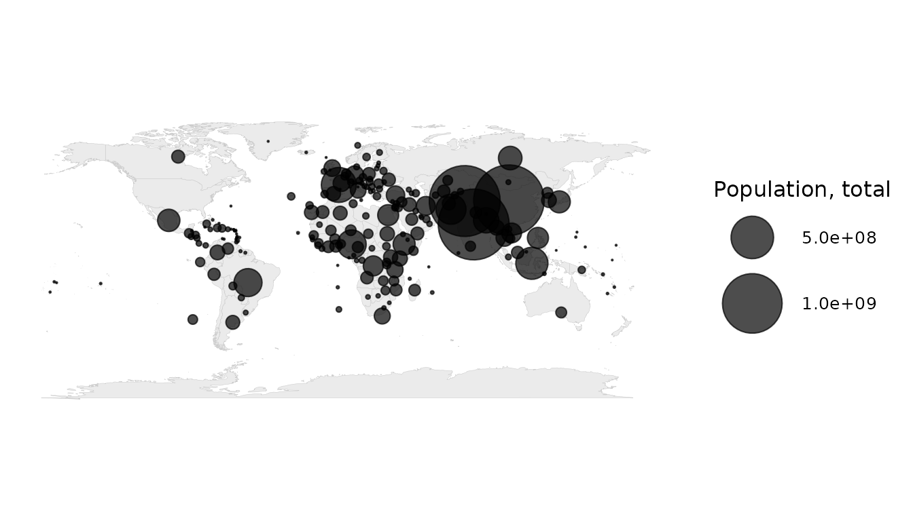
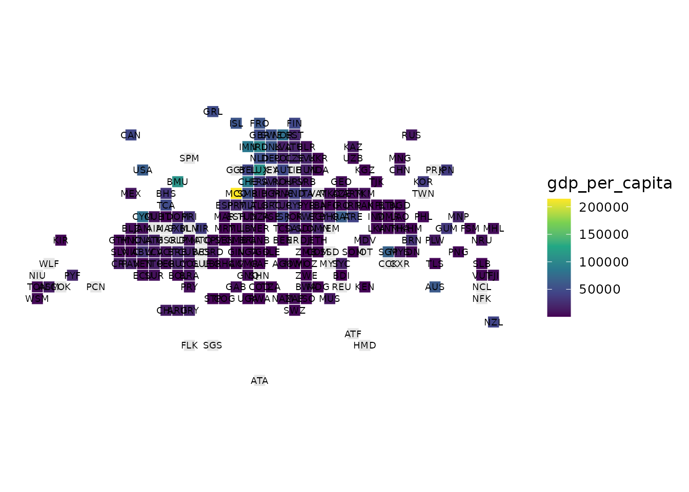
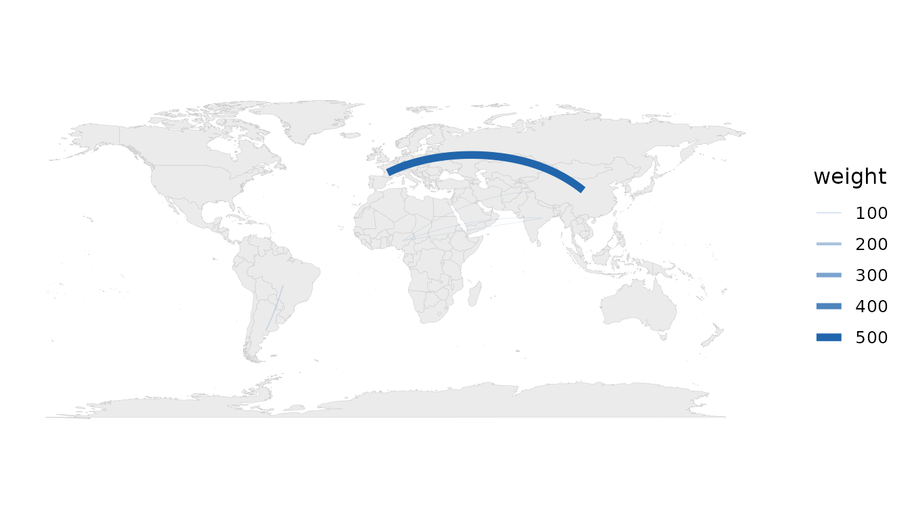
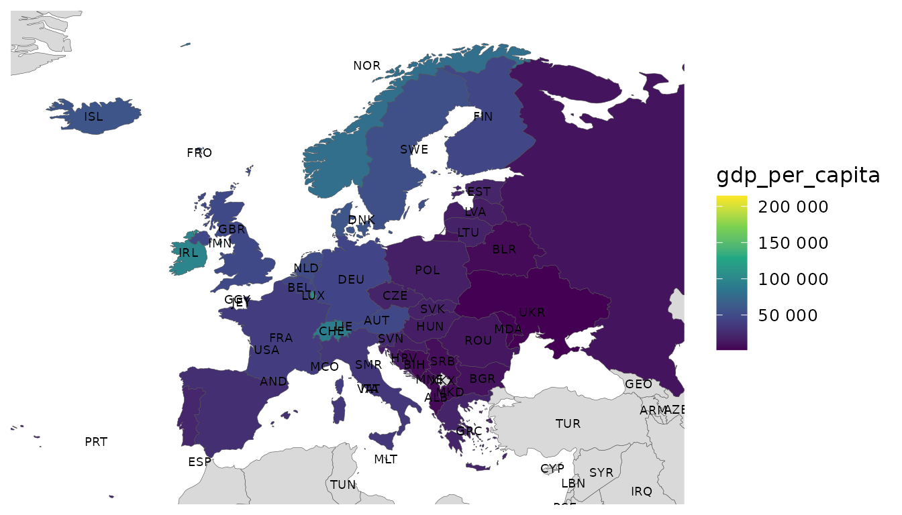

# Beyond the choropleth

“World data on a map” has many honest forms. A choropleth is only the
first. The package offers a full vocabulary; this vignette tours the
ones that run without extra dependencies and points to the rest.

## Proportional-symbol (bubble) maps

For *totals*, a choropleth misleads: large values hide in small
countries. Sized circles at centroids are the right idiom.

``` r

bubble_map(snap, population)
```



## Equal-area tile grids

Give every country the same visual weight so micro-states are visible.

``` r

tile_map(snap, gdp_per_capita)
```



## Flow maps

Great-circle arcs between country pairs from an origin–destination
table.

``` r

od <- data.frame(
  from   = c("China", "Germany", "Brazil", "Nigeria"),
  to     = c("United States", "France", "Argentina", "India"),
  weight = c(500, 200, 90, 60)
)
flow_map(od, from, to, weight)
```



## Labels

Centroid-anchored labels (names, ISO codes or flag emoji), with
`ggrepel` collision avoidance when available.

``` r

mapdf <- attach_geometry(
  dplyr::filter(snap, continent == "Europe"), geometry = "polygon"
)
world_map(mapdf, gdp_per_capita) +
  geom_country_labels(repel = FALSE, size = 2.5) +
  ggplot2::coord_cartesian(xlim = c(-25, 45), ylim = c(34, 72))
```



## Maps that need optional packages

The remaining displays follow the same one-call pattern but require
optional packages, so they are shown here as code:

``` r

# Bivariate choropleth (two variables at once) — needs `biscale` + `sf`
world_data(2020, c(gdp = "NY.GDP.PCAP.KD", life = "SP.DYN.LE00.IN"),
           geometry = "sf") |>
  bivariate_map(gdp, life)

# Area-honest cartogram — needs `cartogram` + `sf`
world_data(2020, c(pop = "SP.POP.TOTL"), geometry = "sf") |>
  cartogram_map(pop, type = "dorling")

# Animated choropleth over a year panel — needs `gganimate`
world_data(2000:2020, c(gdp = "NY.GDP.PCAP.KD")) |>
  animate_world(gdp)

# Interactive choropleth — needs `leaflet`, `ggiraph` or `plotly`
world_data(2020) |>
  interactive_map(gdp_per_capita, engine = "plotly")
```

Each degrades gracefully: if the optional package is missing you get a
clear, actionable message (and
[`animate_world()`](https://pursuitofdatascience.github.io/worlddatajoin/reference/animate_world.md)
falls back to a faceted small-multiple).
