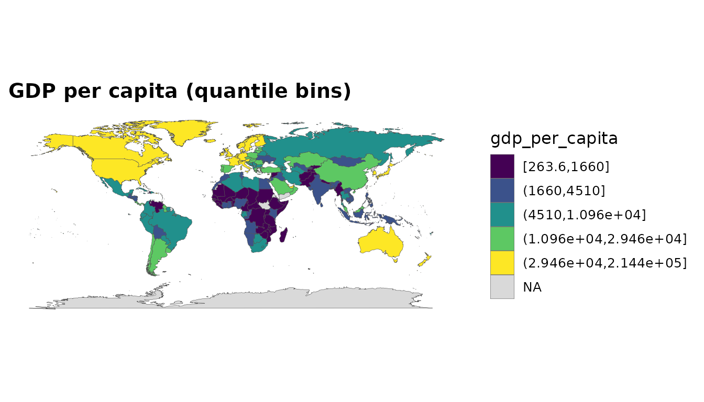
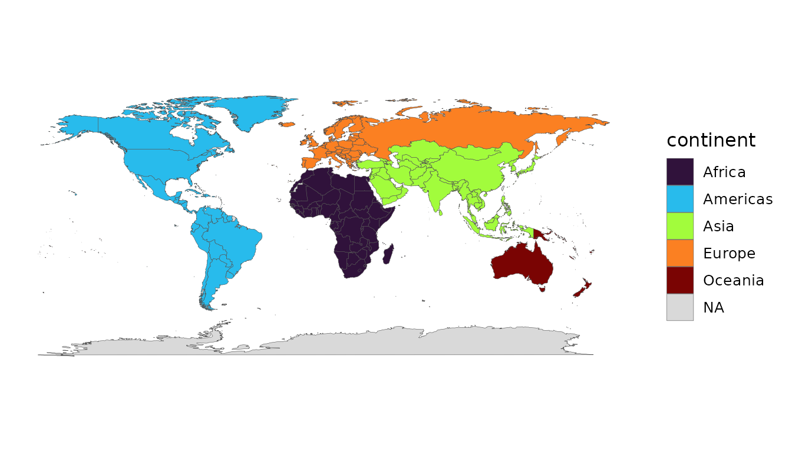
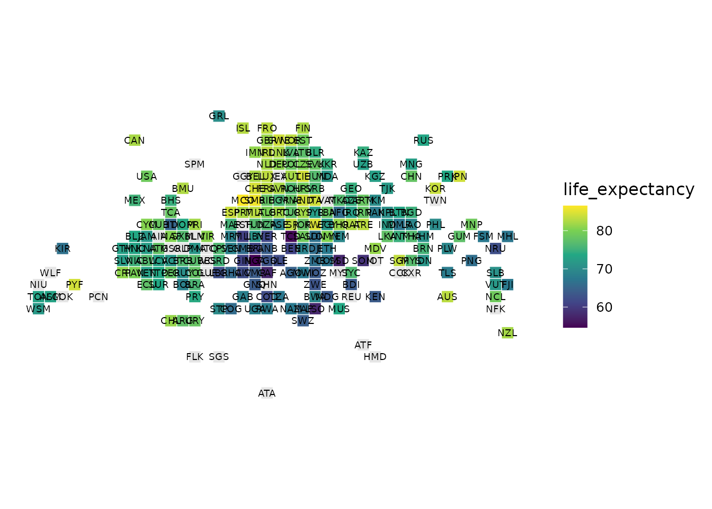
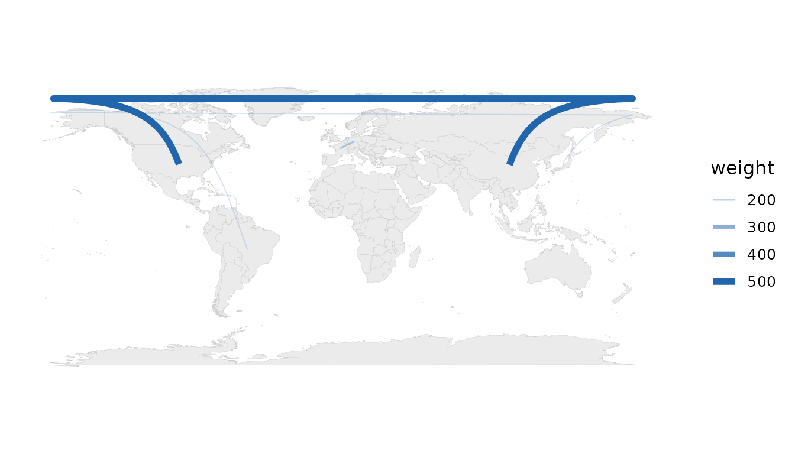

# countryatlas: Joining World Data to Maps on the ISO Spine

## Abstract

Joining country-level data across independent sources is deceptively
hard: the same country is spelled `"US"`, `"U.S."`, `"United States"`
and `"United States of America"`, and a naïve join treats them as
different entities. **countryatlas** resolves this friction by adopting
ISO 3166 codes as a universal join key and by stitching together three
otherwise disjoint resources — map geometry, World Bank development
indicators, and a comprehensive country-code crosswalk — into a single,
map-ready table. This vignette presents the package’s design philosophy,
its complete functional vocabulary, and worked examples spanning data
assembly, the join engine, diagnostics, reference data, analysis helpers
and a full grammar of honest cartographic displays. All examples run
offline against a bundled data snapshot.

## Introduction

The package rests on a single conviction: *if a task does not make it
easier to get country data onto a map — or to make that map honest — it
does not belong here*. Concretely, three packages are combined:

- **`ggplot2::map_data("world")`** (or Natural Earth via `sf`) supplies
  polygon geometry, i.e. *where* countries are;
- **`WDI`** supplies World Bank indicators, i.e. *what is true* about
  them;
- **`countrycode`** supplies the crosswalk of ISO codes, continents and
  regions that makes a reliable join possible.

Three design commitments follow. First, **the happy path is one call**:
`world_data(2020)` returns a tibble ready to map. Second, **the ISO code
is the spine**: every function speaks `iso3c`/`iso2c` internally and
exposes it, so anything the package produces joins to anything else —
and to the user’s own data. Third, **no country is lost silently**:
entities that map backends spell idiosyncratically are *matched* through
a curated override table rather than dropped, and unmatched values are
reported explicitly.

To keep every example reproducible without a network connection, this
vignette uses the bundled `world_snapshot` dataset, a curated set of
indicators for one recent year.

``` r

snapshot <- world_snapshot$countries
dplyr::glimpse(snapshot)
#> Rows: 215
#> Columns: 10
#> $ iso3c           <chr> "AFG", "ALB", "DZA", "ASM", "AND", "AGO", "ATG", "ARG"…
#> $ iso2c           <chr> "AF", "AL", "DZ", "AS", "AD", "AO", "AG", "AR", "AM", …
#> $ country         <chr> "Afghanistan", "Albania", "Algeria", "American Samoa",…
#> $ continent       <chr> "Asia", "Europe", "Africa", "Oceania", "Europe", "Afri…
#> $ region          <chr> "South Asia", "Europe & Central Asia", "Middle East & …
#> $ income          <fct> Low income, Upper middle income, Upper middle income, …
#> $ gdp_per_capita  <dbl> 377.6656, 5867.6510, 4544.4669, 13709.0975, 39780.4153…
#> $ population      <dbl> 40578842, 2451636, 45477389, 48342, 79705, 35635029, 9…
#> $ life_expectancy <dbl> 65.61700, 78.76900, 76.12900, 72.75200, 84.01600, 64.2…
#> $ co2_per_capita  <dbl> 0.278420956, 1.845257616, 4.160058529, 0.002068595, NA…
```

## Core data assembly

### `world_data()`

The headline function is generalised but backward-compatible. The
classic call returns the polygon-backed, enriched tibble exactly as
before:

``` r

# Live World Bank API call (not evaluated here to keep the vignette offline):
world_data(2020)
world_data(
  2020,
  indicator = c(life_exp = "SP.DYN.LE00.IN", co2 = "EN.GHG.CO2.PC.CE.AR5"),
  geometry  = "sf",
  region    = "Africa"
)
```

The `indicator` argument accepts one or many WDI codes; a **named**
vector drives clean column names. A range of years (`2000:2020`) yields
a panel keyed on `iso3c` and `year`. The `geometry` argument switches
between the classic `"polygon"` backend, a modern `"sf"` backend with
real projections, and `"none"` for pure analysis.

### `country_data()` and `attach_geometry()`

For analysis you usually want one tidy row per country, not ~99,000
polygon vertices.
[`country_data()`](https://pursuitofdatascience.github.io/countryatlas/reference/country_data.md)
provides exactly that, and geometry is attached only at draw time:

``` r

mapdf <- attach_geometry(snapshot, geometry = "polygon")
dim(mapdf)
#> [1] 99338    15
```

## Visualising: the choropleth and beyond

### One-line choropleths

[`world_map()`](https://pursuitofdatascience.github.io/countryatlas/reference/world_map.md)
encapsulates the plotting boilerplate and offers several honest styles.
A continuous fill on a skewed indicator hides most of the variation, so
binned and quantile styles are first-class:

``` r

world_map(mapdf, gdp_per_capita, style = "quantile",
          title = "GDP per capita (quantile bins)")
```



``` r

world_map(mapdf, continent, style = "categorical")
```



### Proportional-symbol maps

Totals (population, total emissions) are misrepresented by a choropleth
because large values hide in small countries. A bubble map at country
centroids is the right idiom:

``` r

bubble_map(snapshot, population)
```


### Equal-area tile grids

Tiny states vanish on a geographic map. An equal-area tile grid gives
every country the same visual weight:

``` r

tile_map(snapshot, life_expectancy)
```



### Flow maps

Origin–destination data (trade, migration, flights) is drawn as
great-circle arcs, with both endpoints resolved to centroids
automatically:

``` r

flows <- data.frame(
  from   = c("China", "Germany", "Brazil", "India"),
  to     = c("United States", "France", "Japan", "United Kingdom"),
  weight = c(500, 200, 150, 120)
)
flow_map(flows, from, to, weight)
```



## The join engine

The package’s mission, exposed for the reader’s own data. Given a frame
keyed on messy names,
[`standardize_country()`](https://pursuitofdatascience.github.io/countryatlas/reference/standardize_country.md)
attaches ISO codes and classifications:

``` r

messy <- data.frame(
  nation = c("U.S.", "S. Korea", "Czechia", "Kosovo", "Cote d'Ivoire"),
  value  = c(10, 8, 6, 4, 7)
)
standardize_country(messy, nation, warn = FALSE)
#> # A tibble: 5 × 6
#>   nation        value iso3c iso2c continent region               
#>   <chr>         <dbl> <chr> <chr> <chr>     <chr>                
#> 1 U.S.             10 USA   US    Americas  North America        
#> 2 S. Korea          8 KOR   KR    Asia      East Asia & Pacific  
#> 3 Czechia           6 CZE   CZ    Europe    Europe & Central Asia
#> 4 Kosovo            4 XKX   XK    Europe    Europe & Central Asia
#> 5 Cote d'Ivoire     7 CIV   CI    Africa    Sub-Saharan Africa
```

[`join_world()`](https://pursuitofdatascience.github.io/countryatlas/reference/join_world.md)
goes one step further — auto-detecting the country column, standardising
it and attaching geometry — while
[`country_join()`](https://pursuitofdatascience.github.io/countryatlas/reference/country_join.md)
reconciles two independent tables that each key on country names:

``` r

left  <- data.frame(country = c("Czechia", "South Korea"), gdp = c(1, 2))
right <- data.frame(nation  = c("Czech Republic", "Korea, Rep."), pop = c(10, 51))
country_join(left, right, country, nation)
#> # A tibble: 2 × 5
#>   country       gdp iso3c nation           pop
#>   <chr>       <dbl> <chr> <chr>          <dbl>
#> 1 Czechia         1 CZE   Czech Republic    10
#> 2 South Korea     2 KOR   Korea, Rep.       51
```

## Diagnostics: never lose a country silently

[`check_country_match()`](https://pursuitofdatascience.github.io/countryatlas/reference/check_country_match.md)
is a pre-flight report;
[`wdj_overrides()`](https://pursuitofdatascience.github.io/countryatlas/reference/wdj_overrides.md)
is the curated match table that replaces the old drop-list; and
[`audit_coverage()`](https://pursuitofdatascience.github.io/countryatlas/reference/audit_coverage.md)
reports missingness before a half-empty map is published.

``` r

check_country_match(c("USA", "Cote d'Ivoire", "Yugoslavia", "Wakanda"))
#> # A tibble: 4 × 4
#>   input         iso3c matched suggestion
#>   <chr>         <chr> <lgl>   <chr>     
#> 1 USA           USA   TRUE    NA        
#> 2 Cote d'Ivoire CIV   TRUE    NA        
#> 3 Yugoslavia    NA    FALSE   Yugoslavia
#> 4 Wakanda       NA    FALSE   Canada
```

``` r

audit_coverage(snapshot)$na_rates
#> # A tibble: 4 × 4
#>   indicator           n n_missing na_rate
#>   <chr>           <int>     <int>   <dbl>
#> 1 gdp_per_capita    215         9  0.0419
#> 2 population        215         0  0     
#> 3 life_expectancy   215         0  0     
#> 4 co2_per_capita    215        12  0.0558
```

The entities the previous version dropped — Kosovo, Micronesia, the
Virgin Islands and a dozen others — are now matched:

``` r

dropped <- c("Kosovo", "Micronesia", "Virgin Islands", "Canary Islands",
             "Saint Martin")
standardize_country(data.frame(region = dropped), region, warn = FALSE)
#> # A tibble: 5 × 4
#>   iso3c iso2c continent region                   
#>   <chr> <chr> <chr>     <chr>                    
#> 1 XKX   XK    Europe    Europe & Central Asia    
#> 2 FSM   FM    Oceania   East Asia & Pacific      
#> 3 VIR   VI    Americas  Latin America & Caribbean
#> 4 ESP   ES    Europe    Europe & Central Asia    
#> 5 MAF   MF    Americas  Latin America & Caribbean
```

## Reference data and code translation

[`convert_country()`](https://pursuitofdatascience.github.io/countryatlas/reference/convert_country.md)
exposes the full countrycode vocabulary with first-class shortcuts for
the high-value schemes:

``` r

convert_country(c("Japan", "Brazil", "Germany"), to = "flag")
#> [1] "🇯🇵" "🇧🇷" "🇩🇪"
convert_country(c("Japan", "Brazil", "Germany"), to = "currency")
#> [1] "JPY" "BRL" "EUR"
```

Country-group membership is a curated, dated table:

``` r

country_groups("G7")
#> # A tibble: 7 × 3
#>   group iso3c country       
#>   <chr> <chr> <chr>         
#> 1 G7    CAN   Canada        
#> 2 G7    FRA   France        
#> 3 G7    DEU   Germany       
#> 4 G7    ITA   Italy         
#> 5 G7    JPN   Japan         
#> 6 G7    GBR   United Kingdom
#> 7 G7    USA   United States
in_group(c("France", "United States", "Japan", "Brazil"), "EU")
#> [1]  TRUE FALSE FALSE FALSE
```

The package also bundles `country_meta` (static per-country attributes),
`common_indicators` (a friendly indicator catalogue),
`country_groups_tbl` and `world_tiles`.

## Analysis helpers

Small, in-spirit transforms that keep an analysis from leaving the
package mid-pipeline:

``` r

snapshot |>
  rank_countries(gdp_per_capita) |>
  filter(rank <= 5) |>
  select(country, gdp_per_capita, rank, percentile)
#> # A tibble: 5 × 4
#>   country     gdp_per_capita  rank percentile
#>   <chr>                <dbl> <int>      <dbl>
#> 1 Bermuda            109643.     2      0.995
#> 2 Ireland             97794.     4      0.985
#> 3 Luxembourg         107467.     3      0.990
#> 4 Monaco             214360.     1      1    
#> 5 Switzerland         90605.     5      0.980
```

``` r

snapshot |>
  aggregate_regions(population, by = "region", fun = "sum")
#> # A tibble: 8 × 2
#>   region                     population
#>   <chr>                           <dbl>
#> 1 East Asia & Pacific        2356430840
#> 2 Europe & Central Asia       922299160
#> 3 Latin America & Caribbean   649887983
#> 4 Middle East & North Africa  498069857
#> 5 North America               373018004
#> 6 South Asia                 1932289074
#> 7 Sub-Saharan Africa         1229208573
#> 8 NA                            3220137
```

## Performance and offline use

World Bank fetches are memoised with an optional on-disk cache, and
multiple indicators are fetched in parallel where the platform supports
forking. The bundled `world_snapshot` makes every example here run
without the network. The cache can be cleared with
[`clear_wdi_cache()`](https://pursuitofdatascience.github.io/countryatlas/reference/clear_wdi_cache.md).

## Conclusion

`countryatlas` keeps its original soul — ISO codes as the universal join
key, one call to a map-ready table — and extends it into a complete
toolkit: any indicator and any year span, a modern `sf` backend, an
exposed join engine for the user’s own data, honest diagnostics, curated
reference data, analysis helpers, and a full vocabulary of projected,
area-honest maps.

## Session information

``` r

sessionInfo()
#> R version 4.6.0 (2026-04-24)
#> Platform: x86_64-pc-linux-gnu
#> Running under: Ubuntu 24.04.4 LTS
#> 
#> Matrix products: default
#> BLAS:   /usr/lib/x86_64-linux-gnu/openblas-pthread/libblas.so.3 
#> LAPACK: /usr/lib/x86_64-linux-gnu/openblas-pthread/libopenblasp-r0.3.26.so;  LAPACK version 3.12.0
#> 
#> locale:
#>  [1] LC_CTYPE=C.UTF-8       LC_NUMERIC=C           LC_TIME=C.UTF-8       
#>  [4] LC_COLLATE=C.UTF-8     LC_MONETARY=C.UTF-8    LC_MESSAGES=C.UTF-8   
#>  [7] LC_PAPER=C.UTF-8       LC_NAME=C              LC_ADDRESS=C          
#> [10] LC_TELEPHONE=C         LC_MEASUREMENT=C.UTF-8 LC_IDENTIFICATION=C   
#> 
#> time zone: UTC
#> tzcode source: system (glibc)
#> 
#> attached base packages:
#> [1] stats     graphics  grDevices utils     datasets  methods   base     
#> 
#> other attached packages:
#> [1] dplyr_1.2.1        ggplot2_4.0.3      countryatlas_2.0.0
#> 
#> loaded via a namespace (and not attached):
#>  [1] sass_0.4.10        utf8_1.2.6         generics_0.1.4     class_7.3-23      
#>  [5] KernSmooth_2.23-26 digest_0.6.39      magrittr_2.0.5     countrycode_1.8.0 
#>  [9] evaluate_1.0.5     grid_4.6.0         RColorBrewer_1.1-3 fastmap_1.2.0     
#> [13] maps_3.4.3         jsonlite_2.0.0     e1071_1.7-17       viridisLite_0.4.3 
#> [17] scales_1.4.0       stringdist_0.9.17  textshaping_1.0.5  jquerylib_0.1.4   
#> [21] cli_3.6.6          rlang_1.2.0        withr_3.0.3        cachem_1.1.0      
#> [25] yaml_2.3.12        otel_0.2.0         tools_4.6.0        parallel_4.6.0    
#> [29] memoise_2.0.1      vctrs_0.7.3        R6_2.6.1           proxy_0.4-29      
#> [33] lifecycle_1.0.5    classInt_0.4-11    fs_2.1.0           htmlwidgets_1.6.4 
#> [37] ragg_1.5.2         pkgconfig_2.0.3    desc_1.4.3         pkgdown_2.2.0     
#> [41] pillar_1.11.1      bslib_0.11.0       gtable_0.3.6       glue_1.8.1        
#> [45] systemfonts_1.3.2  xfun_0.59          tibble_3.3.1       tidyselect_1.2.1  
#> [49] knitr_1.51         farver_2.1.2       htmltools_0.5.9    rmarkdown_2.31    
#> [53] labeling_0.4.3     compiler_4.6.0     S7_0.2.2
```
