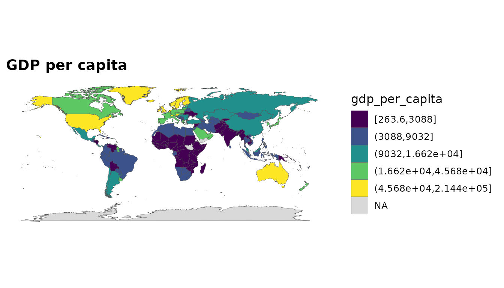
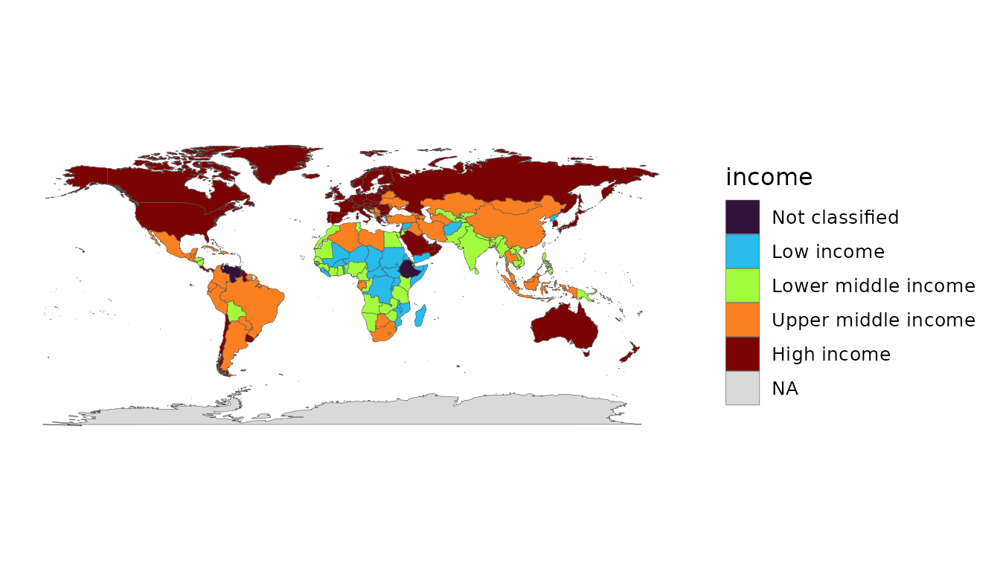

# Getting started

The goal of **countryatlas** is to get country data onto a map with as
little friction as possible, using ISO codes as the universal join key.
The happy path is a single call.

## A map-ready tibble in one call

With a live connection, `world_data(year)` returns everything you need:

``` r

data_2020 <- world_data(2020)
```

To keep this vignette offline, we use the bundled snapshot and attach
geometry ourselves:

``` r

data_2020 <- attach_geometry(world_snapshot$countries, geometry = "polygon")
```

## Your first choropleth

No
[`geom_polygon()`](https://ggplot2.tidyverse.org/reference/geom_polygon.html)
boilerplate —
[`world_map()`](https://pursuitofdatascience.github.io/countryatlas/reference/world_map.md)
does it:

``` r

world_map(data_2020, gdp_per_capita, style = "quantile",
          title = "GDP per capita")
```



Income is an ordered factor, so a categorical fill reads naturally:

``` r

world_map(data_2020, income, style = "categorical")
```



## Choosing indicators

You are not limited to GDP. Pass any World Bank indicator code (named,
for clean columns), or browse the bundled catalogue:

``` r

head(common_indicators)
#> # A tibble: 6 × 3
#>   name                   code           description                       
#>   <chr>                  <chr>          <chr>                             
#> 1 population             SP.POP.TOTL    Population, total                 
#> 2 gdp                    NY.GDP.MKTP.CD GDP (current US$)                 
#> 3 gdp_constant           NY.GDP.MKTP.KD GDP (constant 2015 US$)           
#> 4 gdp_per_capita         NY.GDP.PCAP.KD GDP per capita (constant 2015 US$)
#> 5 gdp_per_capita_current NY.GDP.PCAP.CD GDP per capita (current US$)      
#> 6 gni_per_capita         NY.GNP.PCAP.CD GNI per capita (current US$)
```

``` r

country_data(2020, c(life_exp = "SP.DYN.LE00.IN", pop = "SP.POP.TOTL"))
```

## Next steps

- *Joining your own data* — get a frame keyed on messy names onto a map.
- *Modern maps with sf & projections* — equal-area, projected maps.
- *Beyond the choropleth* — bubbles, cartograms, tiles, flows and more.
