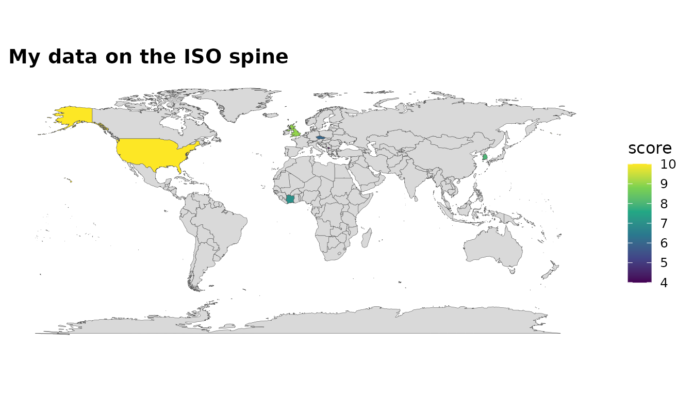

# Joining your own data

The headline use case: *I have a frame keyed on messy country names —
get it on a map.* The package exposes the same matching machinery it
uses internally.

## Standardise any frame

[`standardize_country()`](https://pursuitofdatascience.github.io/worlddatajoin/reference/standardize_country.md)
attaches ISO codes and classifications, reconciling spellings
automatically:

``` r

my_data <- data.frame(
  nation = c("U.S.", "S. Korea", "Czechia", "Kosovo", "Cote d'Ivoire", "UK"),
  score  = c(10, 8, 6, 4, 7, 9)
)
standardize_country(my_data, nation, warn = FALSE)
#> # A tibble: 6 × 6
#>   nation        score iso3c iso2c continent region               
#>   <chr>         <dbl> <chr> <chr> <chr>     <chr>                
#> 1 U.S.             10 USA   US    Americas  North America        
#> 2 S. Korea          8 KOR   KR    Asia      East Asia & Pacific  
#> 3 Czechia           6 CZE   CZ    Europe    Europe & Central Asia
#> 4 Kosovo            4 XKX   XK    Europe    Europe & Central Asia
#> 5 Cote d'Ivoire     7 CIV   CI    Africa    Sub-Saharan Africa   
#> 6 UK                9 GBR   GB    Europe    Europe & Central Asia
```

## One call to a map

[`join_world()`](https://pursuitofdatascience.github.io/worlddatajoin/reference/join_world.md)
auto-detects the country column, standardises it and attaches geometry:

``` r

my_data |>
  join_world(nation, warn = FALSE) |>
  world_map(score, title = "My data on the ISO spine")
```



## Reconcile two messy tables

[`country_join()`](https://pursuitofdatascience.github.io/worlddatajoin/reference/country_join.md)
joins two frames that each key on country names, by reconciling both
sides to `iso3c` first:

``` r

a <- data.frame(country = c("Czechia", "South Korea", "Russia"), gdp = 1:3)
b <- data.frame(nation  = c("Czech Republic", "Korea, Rep.", "Russian Federation"),
                pop = c(10, 51, 144))
country_join(a, b, country, nation)
#> # A tibble: 3 × 5
#>   country       gdp iso3c nation               pop
#>   <chr>       <int> <chr> <chr>              <dbl>
#> 1 Czechia         1 CZE   Czech Republic        10
#> 2 South Korea     2 KOR   Korea, Rep.           51
#> 3 Russia          3 RUS   Russian Federation   144
```

## Check before you trust

Always inspect what failed to match:

``` r

check_country_match(my_data$nation)
#> # A tibble: 6 × 4
#>   input         iso3c matched suggestion
#>   <chr>         <chr> <lgl>   <chr>     
#> 1 U.S.          USA   TRUE    NA        
#> 2 S. Korea      KOR   TRUE    NA        
#> 3 Czechia       CZE   TRUE    NA        
#> 4 Kosovo        XKX   TRUE    NA        
#> 5 Cote d'Ivoire CIV   TRUE    NA        
#> 6 UK            GBR   TRUE    NA
```

If something legitimately cannot be matched, extend the override table:

``` r

wdj_overrides(c(Somaliland = "SOM"))[c("Kosovo", "Somaliland")]
#>     Kosovo Somaliland 
#>      "XKX"      "SOM"
```

## Custom origins

If your key is already an ISO-2 or World Bank code, tell
[`standardize_country()`](https://pursuitofdatascience.github.io/worlddatajoin/reference/standardize_country.md)
via `origin`:

``` r

df <- data.frame(code = c("US", "KR", "BR"))
standardize_country(df, code, origin = "iso2c", warn = FALSE)
#> # A tibble: 3 × 5
#>   code  iso3c iso2c continent region                   
#>   <chr> <chr> <chr> <chr>     <chr>                    
#> 1 US    USA   US    Americas  North America            
#> 2 KR    KOR   KR    Asia      East Asia & Pacific      
#> 3 BR    BRA   BR    Americas  Latin America & Caribbean
```
