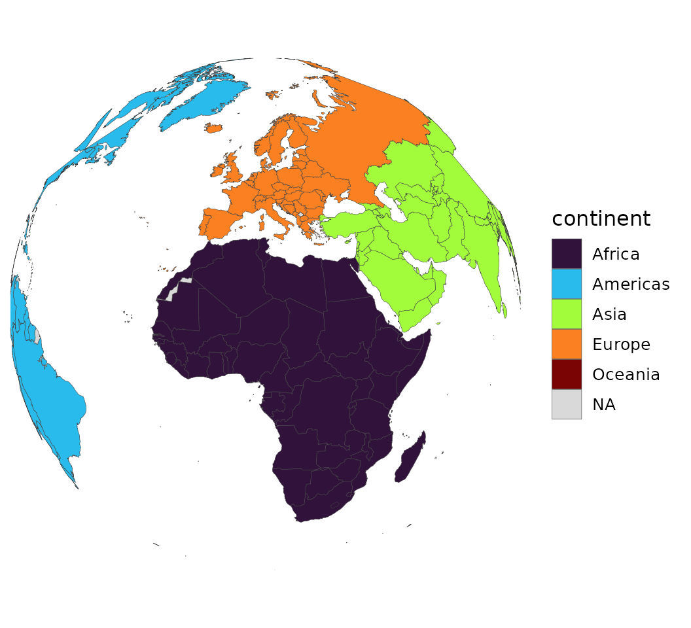
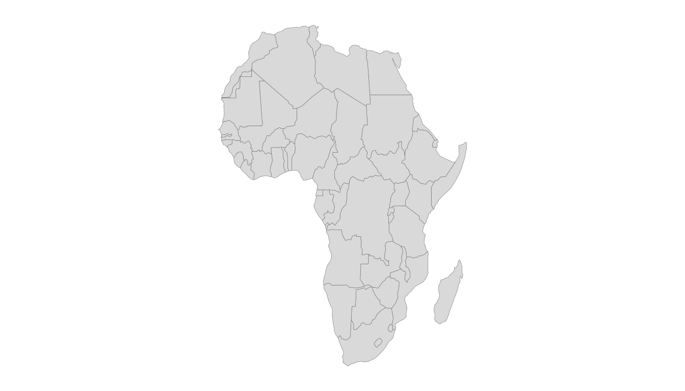

# Modern maps with sf & projections

The legacy `maps` polygons are an unprojected plate carrée: they badly
distort area and split Russia, Fiji and New Zealand across the
antimeridian. The `sf` backend fixes all of this — real projections,
equal-area options, and an antimeridian-safe pipeline. These features
require the optional `sf` and `rnaturalearth` packages.

``` r

install.packages(c("sf", "rnaturalearth", "rnaturalearthdata"))
```

## An equal-area, projected choropleth

``` r

world_data(2020, c(gdp = "NY.GDP.PCAP.KD"), geometry = "sf") |>
  world_map(gdp, style = "quantile", projection = "equal_earth",
            title = "GDP per capita (Equal Earth projection)")
```

[`world_map()`](https://pursuitofdatascience.github.io/countryatlas/reference/world_map.md)
auto-detects the `sf` backend and applies the projection through
[`ggplot2::coord_sf()`](https://ggplot2.tidyverse.org/reference/ggsf.html).
Available projections are `"equal_earth"` (the default — equal-area and
good-looking), `"robinson"`, `"mollweide"`, `"natural_earth"`,
`"plate_carree"`, `"mercator"`, `"winkel_tripel"`, `"eckert4"`,
`"gall_peters"`, `"orthographic"`, `"azimuthal_equal_area"`,
`"north_polar"` and `"south_polar"`.

## The world as a globe

[`globe_map()`](https://pursuitofdatascience.github.io/countryatlas/reference/globe_map.md)
draws an orthographic globe centred on `lon`/`lat`. The default `"sf"`
backend gives the cleanest limb; the `"polygon"` backend below needs
only `maps` + `mapproj` (no `sf`):

``` r

globe_map(world_snapshot$countries, continent, backend = "polygon",
          style = "categorical", lon = 10, lat = 20)
```



``` r

# With the sf backend (smoother limb, real great circles):
world_data(2020, geometry = "sf") |>
  globe_map(gdp_per_capita, lon = 10, lat = 30)
```

[`spin_globe()`](https://pursuitofdatascience.github.io/countryatlas/reference/spin_globe.md)
turns that into a rotating animation — one
[`globe_map()`](https://pursuitofdatascience.github.io/countryatlas/reference/globe_map.md)
frame per central longitude, assembled into a looping GIF with `gifski`
(or `magick`):

``` r

spin_globe(world_snapshot$countries, continent, backend = "polygon",
           style = "categorical", n_frames = 60)
```

## Just the canvas

[`world_geometry()`](https://pursuitofdatascience.github.io/countryatlas/reference/world_geometry.md)
returns projected, region-subset, antimeridian-safe geometry without any
data — country polygons, label-ready centroids, coastlines, a graticule
or an ocean rectangle:

``` r

africa <- world_geometry("countries", geometry = "sf", region = "Africa",
                         projection = "equal_earth")
ggplot(africa) +
  geom_sf(fill = "grey85", colour = "grey40", linewidth = 0.1) +
  theme_world_map()
```



## Recentring and the antimeridian

A Pacific-centred world is one argument away; the `sf` pipeline runs
[`sf::st_break_antimeridian()`](https://r-spatial.github.io/sf/reference/st_break_antimeridian.html)
before projecting, so nothing streaks across the frame:

``` r

world_geometry("countries", geometry = "sf", recenter = 150)
```

## Region subsetting

`region` accepts a continent, a group name (`"EU"`, `"OECD"`, …), a
vector of `iso3c` codes, or a bounding box `c(xmin, ymin, xmax, ymax)`,
and picks a sensible projection for it.

## Simplifying for the web

High-resolution geometry can be thinned for fast plotting with
[`simplify_geometry()`](https://pursuitofdatascience.github.io/countryatlas/reference/simplify_geometry.md)
(which uses `rmapshaper` when available).

``` r

world_geometry(geometry = "sf", scale = "large") |>
  simplify_geometry(keep = 0.1)
```
